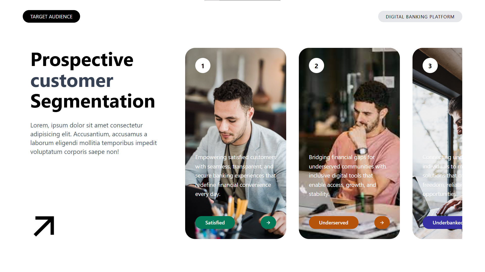

# Customer Segmentation UI

A modern landing page built with **React.js** and **Tailwind CSS** to practice component-based architecture, props handling, dynamic rendering, and responsive UI design.

## Overview

This project showcases a customer segmentation interface for a digital banking platform. It presents different audience groups using visually appealing cards with images, descriptions, and category labels.

The primary goal of this project was to understand:

* React Components
* Props
* Component Composition
* Data Flow Between Components
* Array Mapping with `.map()`
* Dynamic Styling
* Tailwind CSS Utility Classes

---

## 📸 UI Preview

### Desktop View

Add a screenshot of the application here:

```

```

> Note: This project is currently optimized for desktop screens and was built primarily for learning React component architecture, props, and Tailwind CSS. Responsive design will be added in future updates.

---

## Features

* Modern landing page layout
* Reusable React components
* Dynamic card generation using `.map()`
* Props passed through multiple component levels
* Horizontal card scrolling
* Dynamic background colors
* Responsive Flexbox-based structure
* Tailwind CSS styling
* Remix Icons integration

---

## Project Structure

```
├── 📁 public
│   ├── 📁 screenshots
│   │   └── 🖼️ homepage.png
│   └── 🖼️ vite.svg
├── 📁 src
│   ├── 📁 assets
│   │   └── 🖼️ react.svg
│   ├── 📁 components
│   │   └── 📁 Section1
│   │       ├── 📄 Arrow.jsx
│   │       ├── 📄 HeroText.jsx
│   │       ├── 📄 LeftContent.jsx
│   │       ├── 📄 Navbar.jsx
│   │       ├── 📄 Page1Content.jsx
│   │       ├── 📄 RightCard.jsx
│   │       ├── 📄 RightCardContent.jsx
│   │       ├── 📄 RightContent.jsx
│   │       └── 📄 Section1.jsx
│   ├── 📄 App.jsx
│   ├── 🎨 index.css
│   └── 📄 main.jsx
├── ⚙️ .gitignore
├── 📝 README.md
├── 📄 eslint.config.js
├── 🌐 index.html
├── ⚙️ package-lock.json
├── ⚙️ package.json
└── 📄 vite.config.js
```

---

## Component Flow

```text
App
│
└── Section1
    │
    ├── Navbar
    │
    └── Page1Content
        │
        ├── LeftContent
        │   ├── HeroText
        │   └── Arrow
        │
        └── RightContent
            │
            └── RightCard (mapped)
                │
                └── RightCardContent
```

---

## Concepts Practiced

### Props

Data is passed from `App.jsx` to child components:

```jsx
<Section1 users={users} />
```

and eventually reaches:

```jsx
<RightCard
  img={elem.img}
  intro={elem.intro}
  tag={elem.tag}
  bg={elem.bg}
/>
```

---

### Array Mapping

Cards are generated dynamically:

```jsx
props.users.map((elem, idx) => {
  return <RightCard key={idx} />;
});
```

---

### Dynamic Styling

Button colors are controlled using data:

```jsx
style={{ backgroundColor: props.bg }}
```

This allows each card to have its own unique theme color.

---

## Technologies Used

* React.js
* JavaScript (ES6+)
* Tailwind CSS
* Remix Icons
* Vite

---


---

## Learning Outcomes

By building this project, I gained hands-on experience with:

* Creating reusable React components
* Passing props through component hierarchies
* Rendering dynamic content with arrays
* Managing UI structure using Flexbox
* Styling applications using Tailwind CSS
* Organizing React projects into scalable component structures

---

## 🚀 Future Improvements

* Make the layout fully responsive
* Add Framer Motion animations
* Fetch customer data from APIs
* Add filtering and search functionality
* Improve accessibility
* Add dark mode support

---

## 👨‍💻 Author

### Gulam Mohyudin Memon

**Full Stack Web Developer**

> Built as a React and Tailwind CSS learning project to strengthen understanding of:

### Connect With Me

* GitHub: https://github.com/yourusername
* LinkedIn: https://linkedin.com/in/yourusername

---
